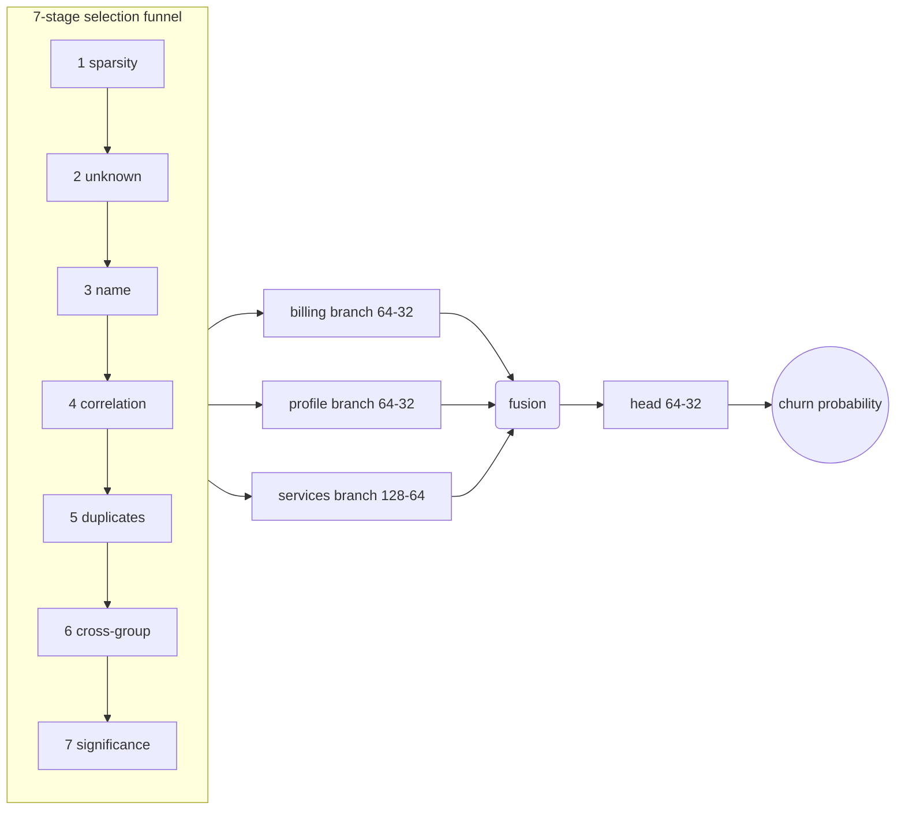

# model-forge

**Two applied deep-learning studies: build a model from scratch, and fine-tune one that
already exists.** Both end-to-end — data, training, evaluation, and (for the second)
serving — with every number reproducible on a laptop.

[](https://github.com/HassaanSaleem/model-forge/actions/workflows/ci.yml)
[](pyproject.toml)
[](LICENSE)

| Study | Skill demonstrated | Result |
|---|---|---|
| [Churn fusion network](notebooks/01_churn_fusion.ipynb) | **Model creation** — custom multi-input architecture + a 7-stage feature-selection funnel | ROC AUC **0.8476** on IBM Telco |
| [T5 log summarizer](notebooks/02_finetune_t5_log_summarizer.ipynb) | **Fine-tuning** — seq2seq fine-tune of `t5-small` + pooled inference serving | ROUGE-2 **0.18 → 0.34** vs zero-shot |

## Why this exists

Both studies rebuild methods I designed and ran in production, on public data so the
results are verifiable. Patterns only — no code, data, or names from the originals.

- The **churn** ancestor scored subscription invoices at warehouse scale: raw billing
  rows pivoted into a wide invoice-level matrix across three feature families (billing,
  profile, behavioral events), cut to a fraction of its width by the selection funnel.
  Here the same funnel and the same branch-per-family network run on the canonical
  public benchmark (IBM Telco, 7,043 customers).
- The **summarizer** ancestor sat inside an alerting pipeline that drowned in
  near-duplicate alerts: summarization normalized log messages so content-hash
  deduplication could collapse most of the redundancy. Here the same recipe fine-tunes
  `t5-small` on a 4,000-pair fully synthetic log→summary corpus and serves it behind
  the same semaphore-pooled API design.

## Study 1 — churn fusion network (model creation)



The two ideas that carry the study:

1. **Selection before architecture.** Seven auditable stages, each logging what it killed
   and why: sparsity, unknown-ratio, and name filters (warehouse-computable — they can
   run as SQL so dead columns never leave the warehouse), then
   correlation, duplicate-categorical, and cross-group dedup in pandas, and finally
   `f_classif` significance (p < 0.05, train split only). On Telco: 25 candidates → 21
   encoded inputs.
2. **A branch per feature family.** Billing, profile, and services each get a dense
   branch sized to their signal, then a fusion layer concatenates. One tower would let
   the widest family drown out the rest.

Result (seeded, identical from the notebook and the CLI):

| accuracy | precision | recall | f1 | **ROC AUC** | params |
|---|---|---|---|---|---|
| 0.765 | 0.542 | 0.738 | 0.625 | **0.8476** | 27K |

Class-weighted training deliberately trades precision for recall — a retention offer is
cheap, a lost subscriber is not. Full run artifacts live in [docs/churn/](docs/churn/).

```bash
pip install -e ".[churn]"
python -m model_forge.churn.train          # downloads Telco once, trains, evaluates
```

## Study 2 — T5 log summarizer (fine-tuning + serving)

Fine-tunes `google-t5/t5-small` (60M params) on [data/log_summary_pairs.csv](data/log_summary_pairs.csv) —
4,000 **fully synthetic** log→summary pairs describing infrastructure failures
(container OOMs, database errors, TLS expiry, queue dead-letters), produced by the
seeded template grammar in `src/model_forge/summarizer/corpus.py`. The recipe is
deliberately boring and correct: task prefix `summarize:` at train **and** inference (forgetting it at serving
time is the classic way to silently lose the fine-tune), 256/128 token truncation,
label pads masked to −100, LR 5e-5 with linear decay and 500 warmup steps, per-epoch
eval, best-checkpoint restore, early stopping.

Held-out ROUGE (400 pairs the trainer never trained on), base vs fine-tuned:

| model | ROUGE-1 | ROUGE-2 | ROUGE-Lsum |
|---|---|---|---|
| `t5-small` (zero-shot) | 0.4591 | 0.1834 | 0.3265 |
| fine-tuned | **0.6022** | **0.3384** | **0.4505** |

Zero-shot `t5-small` mostly echoes fragments of the input; the fine-tune writes an
actual summary — component, cause, and code in one fluent statement. Side-by-side
generations: [docs/summarizer/examples.md](docs/summarizer/examples.md).

```bash
pip install -e ".[summarizer]"
python -m model_forge.summarizer.train      # ~15 min on Apple MPS, ~40 min CPU
python -m model_forge.summarizer.evaluate   # base-vs-tuned ROUGE + examples
```

### Serving

Transformer inference is blocking and not re-entrant, so the API holds a **pool of N
model replicas behind a semaphore**: at most N requests run inference concurrently
(round-robin across replicas), the rest queue, and `/health_check` probes the pool —
a saturated pool answers 503 so orchestrators shed load instead of queueing behind it.
The event loop never runs a forward pass; generation happens on a thread pool.

```bash
MODEL_DIR=models/log-summarizer-t5 python bin/serve.py
curl -s localhost:8000/summarize -H 'content-type: application/json' \
  -d '{"text": "ERROR Failed to connect to database. Function connectDB. Access denied for user."}'
```

Or in Docker (trains in a container too, if you have no local Python):

```bash
docker compose --profile train run --rm train   # writes ./models/log-summarizer-t5
docker compose up api                            # serves it on :8000
```

## The corpus

`data/log_summary_pairs.csv` is **generated, not collected**: 4,000 unique pairs from a
seeded template grammar (`src/model_forge/summarizer/corpus.py`) spanning 14
infrastructure failure domains, each rendered through several log shapes — terse
key-value lines, bracketed logger output, prose — while the paired summary restates
component, cause, and code in fluent prose. That many-surface-forms → one-normalized-
statement mapping is exactly the job the fine-tune must learn. Because every byte comes
from the generator, provenance is trivial: there is no source dataset and nothing to
leak, and `python -m model_forge.summarizer.corpus` reproduces the file byte-for-byte.
The generator's own tests pin determinism, uniqueness, log/summary fact agreement, and
the absence of anything credential-shaped.

## Layout

```
src/model_forge/
├── churn/
│   ├── data.py          # Telco download/cache, cleaning, engineered features, branch groups
│   ├── selection.py     # the 7-stage funnel — every stage returns an audit report
│   ├── preprocess.py    # per-group encoding (label-encode + standardize)
│   ├── model.py         # multi-input fusion network (Keras functional)
│   └── train.py         # seeded end-to-end run -> metrics.json + evaluation.png
└── summarizer/
    ├── train.py         # the fine-tune recipe (HF Trainer)
    ├── evaluate.py      # base-vs-tuned ROUGE on the held-out split
    ├── model.py         # tokenizer+model wrapper; owns the task prefix
    ├── pool.py          # semaphore-bounded round-robin replica pool
    └── api.py           # FastAPI: /summarize, /batch_summarize, /health_check
notebooks/               # the two studies as narrated, executed notebooks
data/                    # the training corpus (Telco downloads on first run)
docs/                    # canonical run artifacts: metrics, plots, ROUGE, examples
```

## Testing & CI

`pytest` runs fully offline — the selection funnel, preprocessing, and churn data
engineering are tested on synthetic frames; the pool and API are tested against stub
models, so CI never downloads weights. The torch stack isn't installed in CI at all.

```bash
pip install -e ".[churn,dev]" fastapi
ruff check src tests && pytest
```

## License

MIT — see [LICENSE](LICENSE).
